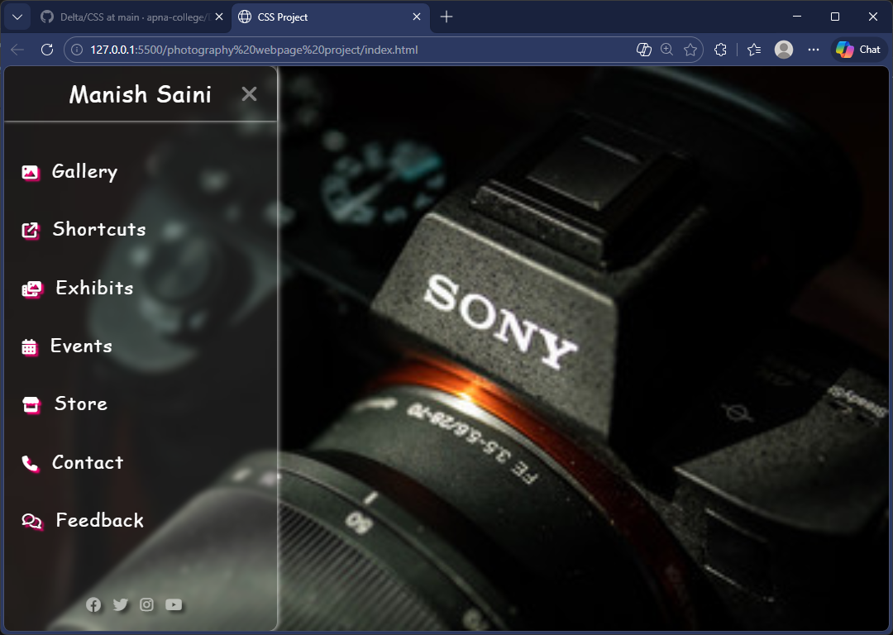

# 📸 CSS Photography Webpage

A modern and responsive photography website built using **HTML5** and **CSS3**.  
This project showcases a clean gallery layout, stylish UI design, and smooth user experience.

---

## 🚀 Features

- 📷 Beautiful Photography Gallery
- 🎨 Modern CSS Styling
- 📱 Fully Responsive Design
- 🧭 Simple Navigation Bar
- 💡 Clean and Organized Code Structure

---

## 🛠️ Technologies Used

- HTML5
- CSS3
- Flexbox
- background properties

---

## 📂 Project Structure

photography-project/
│
├── index.html
├── style.css
├── images/
└── README.md

---

## 📸 Preview

---

## 🔧 How to Run the Project

1. Clone or download this repository
2. Open the project folder
3. Open `index.html` in your browser

---

## 👨‍💻 Author

Manish Saini 

GitHub: https://github.com/manishSaini07

---

## ⭐ Support

If you like this project, please give it a ⭐ on GitHub!
😘✌️